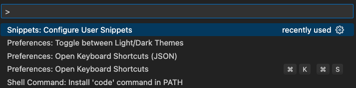
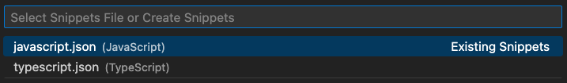

## 
### [home](../README.md) / 00-config
## 

## 📖 | Introduction

The main concept of the project is to base snippets on the keyboard keys from the left hand and link them with JavaScript logic. This means that we can conditionally divide JavaScript into simple ✨, complex 🧩 , and universal 🌍 data, meaning we have three levels 🎚️, and each keyboard row can be responsible for each of these levels. So, we can end up with three rows of keyboard 🎹 : "qwer", "asdf", "yxcv".

<p align="center">
  
</p>

<b> 1️⃣ | Simple data types: qwer </b>

1. q - number
2. w - string
3. e - boolean
4. r - exceptions

<b> 2️⃣ | Complex data types: asdf </b>

1. a - array
2. s - object
3. d - function
4. f - exceptions

<b> 3️⃣ | Universal data types: yxcv </b>

This level is intended for describing classes and methods that solve specific tasks.

P.S. To avoid contradiction between snippet system we will use "j" (JavaScript) before every letter and as result we can see "jq" , "jw", "je", "jr" and etc.

## 🏃‍♂️ | Getting Started

*<em> - Clone project to your local machine: </em>*

```bash
git clone git@github.com:gk-daniel/js-snippets.git
```  

*<em> - Navigate to the project directory using the cd command: </em>*

```bash
cd js-snippets
```  

## 🖼️ | Visual Code

*<em> - To add snippets in VS Code we need to open quick menu (cmd+p) and to find: </em>*

<p align="center">
  
</p>

*<em> - Then to find snippets file that we need and replace content of file: </em>*

<p align="center">
  
</p>