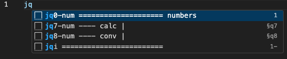
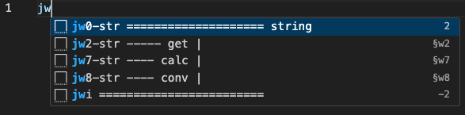
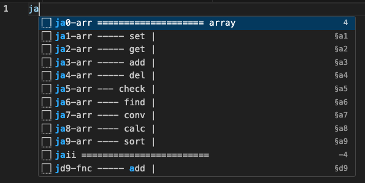
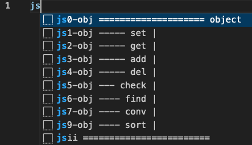
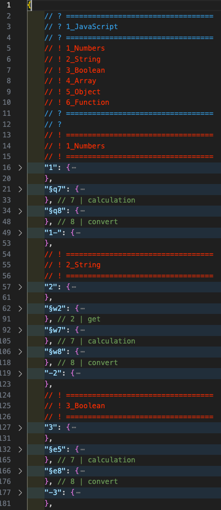
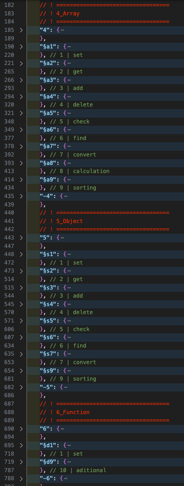

##
### [home](../README.md) / 01-action_based
##

To familiarize yourself with this chapter, please visit the initial explanation on which the idea 💡 is based [introduction](../00-config/intro.md) 📖 .

## 📖 | Introduction

And so, we know that we have two identifiers for the snippet, let's discuss them in more detail 🧐 . 

The first symbol "🅹"  is intended for sorting snippets by the first letter of the name of the technology for which these snippets were written, and in this case, it is "JavaScript" 📜 .

The second symbol "🆆" from the first row "qwer" is a key symbol on the keyboard that denotes a certain type of data, in this case, a string 📝 , since the first row "qwer" corresponds to simple data types.

As a result, we get "🅹🆆" which calls all the methods of the string object in a modal window, and this subchapter will talk about how we will sort these methods 💼 . 

### 🚀 | Actions

Here is a version of the third identifier, which is based on actions, as listed below ⚡️ and no used in a form of letter 📙 .

1. set
2. get
3. add
4. del
5. check
6. find
7. convert
8. sort

In the next section, we can consider examples of how it would work.

## ✨ | Simple Data

 

1. Number

  

2. String

  

3. Boolean

  

## 🧩 | Complex Data

 

1. Array

  

2. Object

  

3. Function

  

## 🌍 | Universe Data

This category has not been defined as unlike the previous ones, it is not standardized and can be customized at your discretion ✍️ .

## 🟰 | Result

Below is an example of a snippet pack `javascript.json` that you can find in the folder `01-action_based`. Note that the following screenshots present the unfolded JSON for better demonstration.

<table align="center">
  <tr>
    <td align="center"></td>
    <td align="center"></td>
  </tr>
  <tr>
    <td align="center">I Part</td>
    <td align="center">II Part</td>
  </tr>
</table>

 