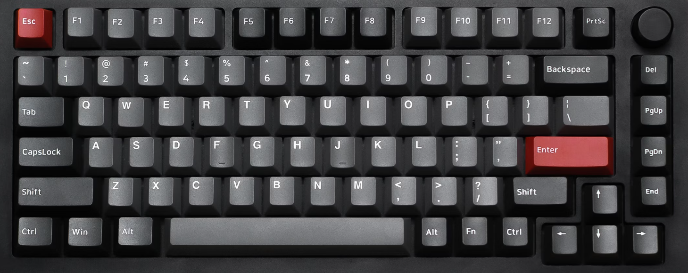

## 
### [home](../README.md) / 01-key_based
## 

Welcome to the key base approach. This approach is based on the layout of the keys on the keyboard, namely qwer, asdf, and yxc, and divides all operations of JavaScript methods into set, get, add, del, check, and filter. How does this approach work? We can take a look at the example below.

#### 1. Keyboard

*<em> - We can split our keyboard into three levels: </em>*



*<em> - Navigate to the project directory using the cd command: </em>*

```bash
cd js-snippets
```

#### 2. Actions