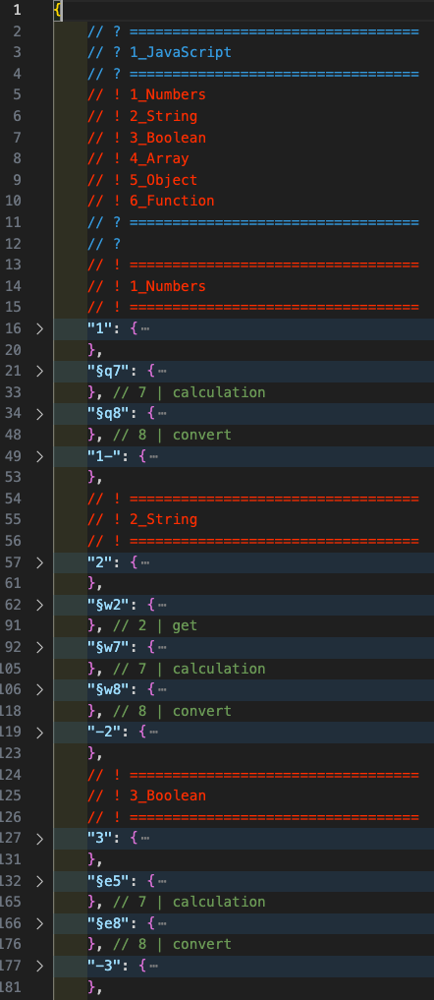
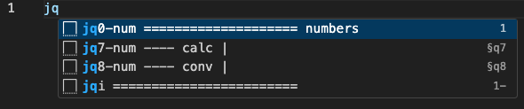
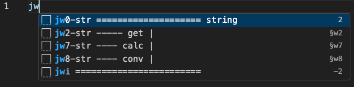
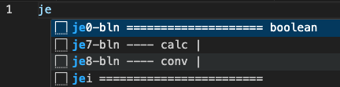
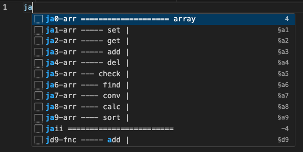
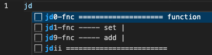

##

### [home](../README.md) / 01-key_based

##

Welcome to the key base approach. This approach is based on the layout of the keys on the keyboard, namely qwer, asdf, and yxc, and divides all operations of JavaScript methods into set, get, add, del, check, and filter. How does this approach work? We can take a look at the description below.

<table align="center">
  <tr>
    <td align="center"></td>
    <td align="center"></td>
  </tr>
  <tr>
    <td align="center">I Part</td>
    <td align="center">II Part</td>
  </tr>
</table>

 

#### 1. Keyboard

_<em> - The idea is to divide each row on the keyboard into a level and link it with the JavaScript structure. So, we can end up with three levels and four columns: "qwer", "asdf", "yxcv". </em>_

  

_<em> I. Simple data types: qwer </em>_

1. q - number
2. w - string
3. e - boolean
4. r - exceptions

_<em> II. Complex data types: asdf </em>_

1. a - array
2. s - object
3. d - function
4. f - exceptions

_<em> III. Universal data types: yxcv </em>_

This level is intended for describing classes and methods that solve specific tasks.

#### 2. Actions

_<em> In the VS Code snippet implementation, when calling the snippet, a modal window opens where snippets are sorted in alphabetical order relative to the symbol we wrote. We can also use this to group snippets by categories. However, besides sorting, we can also insert a small comment that could carry a logical explanation of the snippet's action, something we usually can't see before executing the snippet. But since each statement carries an action, we can categorize them into specific actions, which you can find below. </em>_

1. set
2. get
3. add
4. del
5. check
6. find
7. convert
8. sort

#### 3. Result

To avoid contradiction between snippet system we will use "j" (JavaScript) before every letter and as result we can see

##### 1. Simple Data

1. jq - number

  

2. jw - string

  

3. je - boolean

  

##### 2. Complex Data

1. ja - array

  

2. js - object

  

3. jd - function

  

